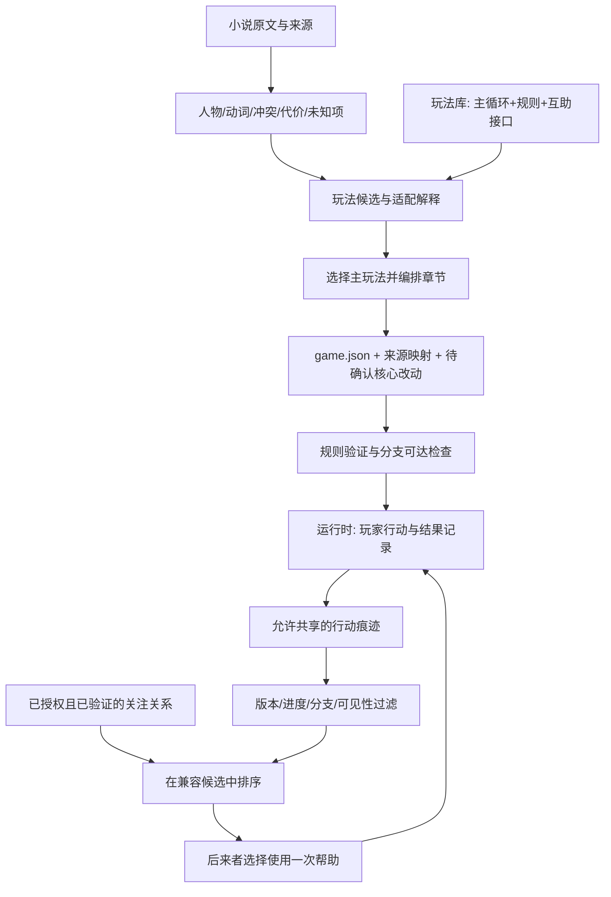

# 看山任意门 PRD v2.1：玩法库 × 前人留痕

2026-09-13｜在 [PRD v2](PRD-v2.md) 基础上补充。本文是产品设计决策；“已实现”仅以[本轮开发交付记录](docs/DEVELOPMENT-20260913.md)的验证为准。异步互助与知乎关系接入仍是待开发能力。

## 1. 产品主张

**穿进一篇故事，亲自处理那个处境；你走过的路，也能让后来的人好走一点。**

用户提出的两件事应组合成产品的两层核心：

1. **玩法库**：根据小说里的人物能力、冲突、可行动空间和代价，选出适合的主玩法。不同小说可以适配同一玩法，同一小说也可以有不同玩法版本。
2. **前人留痕**：玩家真实做过的行动，转成后来者可选择使用的有限帮助。已验证的知乎关注关系可以影响遇见谁的痕迹，陌生人也能帮助你。

社交价值发生在“我在这个处境里，受到了一个人的帮助”。分享和回访是这个经历的延伸。不能只在结局页加一个分享按钮，就称为社交玩法；也不能依赖拉人才能继续玩。

## 2. 玩法库的单位是“主循环”，不是题材标签

“悬疑”“言情”有助于推荐，但不足以决定怎么玩。编译器先提取玩家能做的动词，再选机制。例如职场小说既可以玩话术与关系，也可以玩时间管理；悬疑也不一定要求玩家扮演查案者。

| 玩法模块 | 玩家每轮在做什么 | 需要原作提供什么 | 可复用状态 | 合适的互助入口 |
|---|---|---|---|---|
| 身份伪装 | 观察规则 → 选择回应 → 管理暴露 → 决定何时行动 | 公开常识、秘密身份、被观察的压力 | 时间、关注、伪装准备 | 留下试探方法、一次掩护窗口 |
| 探索与辨认 | 选择感知方式 → 获取局部信息 → 判断 → 靠近或撤退 | 可观察环境、认知限制、风险 | 距离、时间、体力、已知事实 | 标记危险位置、共享观察方法 |
| 照料与关系 | 识别需要 → 安排行动 → 观察回应 → 分配有限精力 | 角色需要、生活情境、关系边界 | 精力、环境准备、承诺履行 | 留下工具、环境准备、表达草稿 |
| 资源筹备 | 侦察 → 配置资源 → 遭遇事件 → 调整方案 | 灾害/生存压力、资源、时限 | 水、能源、空间、工期 | 路线、校准方案、少量补给 |
| 社交攻防 | 获得信息 → 谈判/交换 → 作承诺 → 承担后果 | 角色立场、目标、筹码 | 信任、承诺、情报可见性 | 礼制索引、一次澄清机会 |
| 剧本杀推理 | 私下行动 → 交换信息 → 对质 → 重构解释 → 决断 | 可靠真相、时间线、不同角色所知 | 证据状态、发言窗口、私有目标 | 核对方法、备用搜查机会 |
| 知识对战 | 选题/选招 → 作答 → 结算 → 改变战术 | 可校验答案、能力与题目的因果 | 回合、题库、伤势、技能消耗 | 练习机会、解题方法提示 |

每个模块要有：适配条件、操作方式、状态规则、结束条件、失败继续方式、互助接口、测试方法，以及一部完成的样例。第一版只把两种机制做完整，其余先保留设计条目。不能把七行表格宣传成七种已交付玩法。

每篇故事默认“一种主循环 + 一种辅助机制”。当故事无法提供玩法必需的信息时，编译结果应报告缺口或提出另一种玩法，不要求作者凭空补完一整套游戏世界。

## 3. 从《死亡搁浅》借什么

官方资料说明，他人留下的装备、行走形成的路径、休息产生的恢复点都能对后来者有用；帮助不只来自专门捐赠，也来自正常游玩。[小岛工作室攻略](https://kojimaproductions.jp/en/DSTips)

我们借鉴的是**不同时在线的人，通过行动留下的环境变化发生联系**。不照搬运输、道路或赞的经济系统。《死亡搁浅》中赞、声望与成长有具体联系；本项目第一阶段的感谢只作使用反馈，不兑换剧情优势。[PlayStation 攻略](https://blog.playstation.com/?p=218406)

小岛访谈还说明共享内容受进度等条件控制，战斗中帮助不等于另一名玩家实时接管角色。这里对应的设计原则是：先让两局处于兼容的处境，再共享有限帮助；受助者始终负责当前决定。[小岛采访](https://www.famitsu.com/news/201911/02185866.html)

## 4. “前人留痕”的完整体验

### A 玩家：做了一件事，也留下了一点用处

A 在《近视眼》中先听声音、再整理地面、最后照料角色。规则记录动作结果。在章节结束时，系统从真实行动中给出一张候选卡：

> 你清出了一条靠墙通行的路线。要把这个方法留给后来的人吗？

A 确认后，服务端保存可共享的痕迹。A 不必重新写攻略，也不必额外为别人刷材料。不会默认上传完整对话、个人笔记或所有选项。

### B 玩家：遇见帮助，仍需自己行动

B 来到相同版本、相同阶段的房间，看见一条经过适配的提示：

> 一位先到的读者留下了靠墙整理的方法。照这个方法动手，可以少消耗 1 点体力。

B 可以查看、忽略或采用。**采用后仍要亲自执行“整理地面”**，不能直接增加信任、获得关键证据或完成照料。帮助降低一次行动的代价，让 B 多一个选择余地。

若 A 是 B 已验证关注的人、且 A 同意展示身份，可以显示“你关注的 ×× 留下的方法”。否则使用明确的陌生玩家/匿名标签。不推断“好友”，也不暴露谁刚上线、玩到哪一章。

### A 收到真实使用回执

只有 B 实际使用，且规则接受了效果，A 才收到应用内回执：“你的方法帮助一位读者节省了一次体力消耗。”回执不泄露 B 的角色秘密、结局或私密身份。

B 可再留下自己的新方法，也可主动复制分享卡给其他人。分享内容以“我留下了什么帮助”为主，接收者从兼容入口开始，剧情未到时先收藏帮助。系统不自动给知乎关注人发消息。

## 5. 帮助必须改变可操作空间，又不能拿走乐趣

| 层级 | 可以发生的效果 | 适用范围 | 首版决策 |
|---|---|---|---|
| 方法提示 | 告诉玩家“可以比对时间”，不告诉哪位角色撒谎 | 几乎所有故事 | 支持，按已知信息展示 |
| 小额减负 | 某次行动少花 1 点体力，或一次准备时间减免 | 探索、照料、筹备 | 首个要实装的互助效果 |
| 新行动 | 解锁一次演练/试探，行动结果仍由规则决定 | 社交、知识、机关 | 后续模块扩展 |
| 共同建设 | 一群玩家积累工作量，解锁公共营地/展览 | 明确共享世界的作品 | 延后，需要共享世界规则 |

不共享：正确凶手、秘密身份、终局答案、某角色真实爱不爱你、直接完成目标、跨局继承关键关系值。

**首版默认上限：每局最多使用 1 份会改变资源的帮助；帮助不叠加；不取消玩家必须亲自做的关键行动。** 这是待试玩的平衡参数，不是已证实的最优数值。可完全关闭他人痕迹；离线/零关注也能通关。

## 6. 多题材里的具体玩法

### 《蓝血》：借来的判断方法

A 曾比较教材与网页措辞，留下“先核对公开信息，再决定是否公开质疑”的方法。B 可以把一次网页核对的时间成本减少 1；是否相信当地规则、是否留下私人记录，仍由 B 决定。痕迹不会宣告世界真相或揭穿角色身份。

### 《近视眼》：给后来者留一条容易走的路

A 实际完成过“清理地面”，才能留下“沿墙清理的方法”。B 在尚未清理、且当前分支允许清理时，获得一次体力减免。不是替 B 执行照料，也不是赠送角色好感。

### 恋爱/现实故事：替你多争取一次整理表达的机会

分享的是读者的沟通方法；接收者可以先起草一次回应，看到它可能触及的已有承诺，再自己决定说不说。不跨局继承“TA 对你好感 +10”，不把私人对白传给别的读者。

### 末日：方案能传递，资源不能无限复制

共享“过滤器安装顺序”或可行路线，让 B 节省一次校准。若要共享实体物资，必须有独立库存、领取上限和不可复制的服务器记录；首版先做方法，不开补给经济。

### 剧本杀：留搜查经验，不留作案答案

A 完成票据核对后可留下一条检查方法。B 到达同等线索阶段时，可用它补一次非关键搜查机会。不能传播只有凶手角色知道的事实，也不能把同一房间正在进行的秘密跨人共享。多角色同局与跨局互助是两套权限。

### 知识擂台：共享练习，不替人答题

帮助解锁一次不扣回合的同类练习，正式题仍由玩家作答、规则校验。不能把答案作为“好友礼物”送入考验。

### 怪谈机关：减少试错代价

曾触发机关的玩家可留下经过规则脱敏的检查动作，让后来者多一次低成本试探。痕迹只说“可先检查门轴”，不直接说“第三扇门必死”。

## 7. 解决世界观冲突

不同玩家的剧情不自动属于同一条时间线。

- 原作允许平行时空/副本：可以表现为来自另一位穿越者的痕迹。
- 生存共建世界：可把痕迹具体化成设施，但要明确共享范围。
- 现实、言情、职场：由看山引导层呈现“另一位读者留下的方法”，不让 NPC 凭空知道上一个玩家。

引擎复用帮助的效果；叙事模块决定帮助如何出现。表现方式不能强迫作者重写世界设定。

## 8. 玩法库与编译器怎么对接



“通用”来自三份契约：

1. **故事模型**：原文确定了什么，哪些只是角色信念，哪些后续未知。
2. **玩法模块**：需要哪些状态/动作、如何结算、允许什么互助效果。
3. **内容包**：把本篇小说的人物和处境，绑定到该模块的状态与动作。

编译器可以提出两种玩法候选和适配理由；团队选择一个后生成可运行包。没有实现某模块时输出 `needs_new_mechanic`。不能把“能生成 JSON”当作“所有小说自动变好玩”。当前新增编译路径是人工策划 recipe → 校验后的 game.json；自动选玩法仍待开发。

### 一个拟定互助接口（设计示例，当前运行时尚不读取）

```json
{
  "supportPorts": [{
    "id": "wall_cleaning_method",
    "capability": "discount_action_cost",
    "emitAfter": "clean_surface",
    "receiveAction": "clean_surface",
    "resource": "stamina",
    "discount": 1,
    "maxUsesPerRun": 1,
    "visibility": "method_only",
    "presentation": "reader_trace"
  }]
}
```

帮助记录只携带内容包内已经声明的 `portId`，不携带任意 `effects`、可执行代码或玩家编造的“帮我直接通关”。服务器用接收方版本里的端口定义计算效果，避免客户端或 LLM 任意改资源。

作者只需在系统已经生成的试玩和改编差异上确认：角色/主题底线、哪些核心后果可改变，以及一种互助表现是否破坏作品气质。资源数值、字段、来源摘录、帮助卡模板由团队/系统准备，不交给作者重复填表。

## 9. 知乎 API 能做到哪里

依据用户提供的赛事说明与官方 Skill 0.7.2，详细字段见[API 核对笔记](docs/ZHIHU-SOCIAL-API-NOTES.md)。

| 能力 | 当前文档可确认 | 开发判断 |
|---|---|---|
| 故事列表/节选正文 | 活动内容 API，无需鉴权 | 已有缓存可继续开发；不需要为每局重抓 |
| 当前账号关注 | `/api/v1/user/followees` | Access Secret 只代表它所属的账号 |
| 授权玩家关注 | 应用 Access Secret + 该玩家 `X-OAuth-Token` + 时间戳 | 需要玩家 OAuth，不能拿开发者 key 代替所有人 |
| 基础用户身份 | OAuth `/user` 有 `uid`、`hash_id` 等 | `uid` 为 int64，必须无损解析，不能先转 JS Number |
| 真正好友/互关/粉丝列表 | 新版指定文档没有对应能力 | 暂不承诺；不能把单向关注改名好友 |
| 关注人到游戏账号映射 | 关注项是 `UrlToken`；登录用户是 `uid/hash_id` | 字段对应关系待核实；昵称匹配不可用 |

`/user` 的 `url` 示例为 OpenAPI 地址，并非能直接解析出主页 UrlToken 的承诺。应用可先做自己的玩家身份和匿名互助；官方确认映射或提供可验证标识后，再启用关系优先。接口失效时保留陌生人帮助，不悄悄退回开发者自己的关注列表。

OAuth 对比赛是推荐项；它对“真实关注人优先”功能则是依赖。应用 `app_id/app_key` 与 Access Secret 不同。现有 key 的有效性不能证明已具备 OAuth 应用凭证。

## 10. 异步互助的最小技术闭环

当前游戏主要信任浏览器本地状态，不能直接把 localStorage 中的“我完成了行动”当全网有效贡献。先补一个有界的服务器规则回放：

1. 服务端发 `runId`、包版本、匿名会话；保存该局初始状态与行动序号。
2. 玩家送 actionId 和预期序号；服务器使用同一规则模块执行，拒绝重复序号/非法前置/未知动作。
3. 有合格行动结果才生成候选痕迹；用户确认分享后入库。只传模板所需字段。
4. 获取帮助时过滤 `gameVersion + portId + 剧情阶段 + 分支兼容 + 未用过 + 贡献者非本人`。
5. 在兼容候选中，已验证关注关系优先；留一部分位置给陌生人并轮换，避免只曝光大号。具体比例通过试玩决定。
6. 使用帮助和写入使用回执在同一数据库事务内完成；唯一键至少包含 runId 与 supportPortId，刷新/重试不会重复加资源。
7. 感谢与采用分开计数。只显示实际统计，不伪造“很多人帮助过你”。允许撤回尚未分发的痕迹，旧版本痕迹自动失效。

首版使用持久化存储；双浏览器、两次独立会话证明 A 留下、B 收到。用人工生成的系统引导可以冷启动，但必须标成“看山提示”，不显示假玩家头像和虚构好友。

不在第一版做开放文字留言、物品交易、战力排行榜、自动私信、好友拉人复活、跨作品资产转移。它们会放大剧透、滥用、平衡和授权成本，却不帮助验证“一个人的行动能帮到另一个人”。

## 11. 传播、回访与比赛价值

传播链路：**真实帮助 → 使用回执 → 想知道自己的经历帮到了谁 → 主动分享一张无剧透帮助卡 → 新玩家进入相同处境 → 再贡献。**

卡片例句：“我在这间看不清的屋子里，留了一种整理方法。你会先靠近，还是先听？”分享目标是具体可玩的处境，链接中只放不含身份或 token 的帮助引用；资格不足时不能借分享链接跳过剧情门。

创作侧还可以向作者汇总“哪些处境让读者求助、哪些行动常被采用”，作为改编反馈。需要足够样本且去标识化；首版不把少量测试点击包装成读者洞察。

比赛继续主报「跨次元游乐场」：一部故事多种体验，AI 把人带进角色处境，异步互助让知乎的内容与关系同时进入游戏。社区价值因此更清楚；是否提高完成率或传播仍需实测，不能直接宣称会裂变。

## 12. 推进顺序与验收

- **已完成的基础切片**：两部章节数据、公用动作/资源内核、状态与后果记录、包校验。具体测试及未验证部分以开发记录为准。
- **下一步 S1**：只在《近视眼》做“整理方法减免 1 体力”，补服务器回放、匿名会话与持久化痕迹；两个真实浏览器会话完成 A→B，不用 OAuth 卡住玩法验证。
- **S2**：重试/重复领取/旧版本/错误进度/关闭互助/断网测试；B 仍须完成关键照料行动。
- **S3**：获得赛事应用凭证并由用户完成登录，验证本人基础身份、关注与标识映射；确认后增加“你关注的人”展示与排序。
- **S4**：把相同互助接口适配《蓝血》，证明机制能换内容；根据试玩决定第二类帮助，而非一次建设完整社交平台。

关键验证问题：不用帮助是否仍可完成？用了帮助是否多出一个有意义的选择？玩家是否理解自己为何受到帮助？贡献者是否愿意再来留下痕迹？关注来源与陌生来源是否改变信任和采用意愿？样本不足时报告观察，不报告显著提升。

3 分钟演示优先展示：20 秒两种玩法差异 → 50 秒 A 做清理并留下方法 → 50 秒 B 采用并节省体力、自己完成照料 → 30 秒 A 的真实回执 → 30 秒来源与通用编译说明。OAuth 未联通时只展示匿名真实互助，不摆假好友列表。
