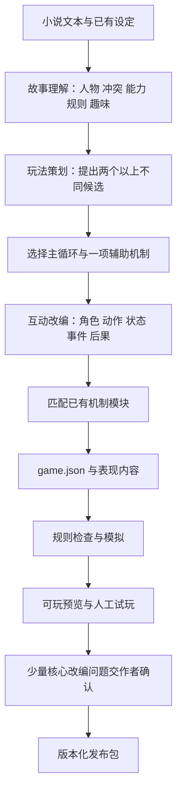

# 看山任意门 PRD 2.0

> **多题材短篇小说的可玩化引擎：穿进故事，做只有在这个故事里才有意思的事。**  
> 日期：2026-09-13｜阶段：策划与研究｜状态：设计提案，尚未实施或试玩验证  
> 基线：项目 PRD1、桌面同版 PRD、既有调研，以及项目中 11 篇不同题材的缓存文本。缓存多为节选，本文不据此断言完整故事的终局。  
> 本轮只交付文档，不变更进行中的代码与 PRD1。`game.json` 是计划中的游戏内容包。

## 1. 产品方向：一种小说，不只对应一种游戏

**看山任意门的核心是把小说里吸引人的处境、能力、关系和世界规则，变成玩家能亲自操作的体验。** 剧本杀是其中值得打磨的一类，其他小说也可以长出伪装、经营、生存、谈判、策略、关系互动和规则实验等玩法。

玩家穿越进去，应当获得一个原作赋予的特殊处境：别人眼里的怪物，在我眼里是需要照顾的家人；我拥有无限金钱，却没有无限时间；我知道历史的走向，但皇帝能听见我的心声。游戏的第一任务是让玩家体验这些处境，而不是先找一套通用按钮，再给按钮换故事文字。

建议将产品分成两个可独立推进的成果：

- **可玩的故事库：** 团队先编排几部操作体验明显不同的游戏，验证什么有趣。现在可以直接手写 `game.json`，不等自动编译器、不等作者来填资料。
- **改编系统：** 从原文提取素材、提出玩法方案、组合机制、编排内容、检查质量。逐步把团队反复做的工作自动化。

对外可以说：**“一篇小说，可以是一场你要维持伪装的约会，也可以是一夜你要照顾怪物的求生。看山任意门把这些可能性编译成游戏。”**

这里的“通用”意味着复用同一套故事分析方法、机制模块和内容运行时；不意味着所有小说都是剧本杀，也不意味着一套固定机制能覆盖所有游戏。

### 1.1 PRD2 的六个决定

1. **按原作的趣味选玩法，题材标签只辅助。** 悬疑不一定找凶手，恋爱不一定刷好感，末世不一定射击。
2. **同一篇至少提出两个操作不同的候选。** 让策划比较哪个保留原作味道、哪个更可玩，再选一个主玩法。
3. **一局一个主循环，叠加一个辅助机制。** 丰富来自机制互动与后果，不是把十种小游戏塞进一局。
4. **剧本杀单独深化。** 身份、个人任务、角色秘密、信息交换、主动 NPC、事件推进、反转与复盘，共同形成戏剧体验；拆谎言只是一个动作。
5. **作者是原作与关键创意的把关者。** 系统先读、先提方案、先做预览；不让作者重填已经写在小说中的人物、时间线和设定。
6. **先证明不同游戏能共用引擎，再证明自动改编省事。** 两项成果分别报告，不以生成了几份 JSON 代替玩法验证。

## 2. 怎样从小说中找到真正可玩的东西

### 2.1 提取“玩家可以做什么”，而不只提取剧情梗概

对每篇故事，系统应形成一张内部的“可玩素材图”。这不是交给作者填写的表单。

| 需要识别的素材 | 要追问的问题 | 可能长出的玩法 |
|---|---|---|
| 主角的特殊能力或限制 | 什么事只有这个主角能做？什么事他做不了？ | 听心声、感官受限、知识施法、身份伪装 |
| 故事的主要趣味 | 读者期待看见什么？反差、翻盘、甜、惊悚、掌控还是理解人物？ | 搞笑救场、逆袭经营、关系协作、异样探索 |
| 可干预的冲突 | 玩家能在谁的要求之间作选择？选择会影响什么？ | 谈判、站队、许诺、交换、保护或背叛 |
| 原作里的行动 | 主角反复做哪些事？ | 试探、采购、调查、照护、求援、备战 |
| 信息差 | 谁知道、谁误解、谁在隐瞒？玩家能改变谁知道什么吗？ | 社交潜入、剧本杀、双向身份戏 |
| 稀缺约束 | 缺钱、时间、行动机会、身份可信度、物资还是支持者？ | 行动规划、资源经营、风险决策 |
| 世界因果 | 某个动作为什么成功／失败？是否可重复利用？ | 规则怪谈、知识战斗、机关实验 |
| 可局部完成的事件 | 在现有文本内，能让玩家完整经历并解决什么？ | 赢下一场对局、度过一晚、守住一次伪装、解决一个案件问题 |

**从素材到玩法的句式：**

> 玩家扮演【身份】，想完成【目标】，通过【两三个反复有意思的动作】，在【限制与对手】下作决定；每次行动会改变【可观察状态】，最后得到【明确结果】。

如果这句话只能填成“玩家读剧情、和 NPC 聊天、最后看结局”，说明还没有设计出主玩法。

### 2.2 同一素材可以生成不同的游戏

例如一篇“双方隐瞒身份的恋爱小说”：

- 以**识破对方**为目标，可以做观察与试探。
- 以**守住自己的伪装并完成一次约会**为目标，可以做场景喜剧与掩饰策略。
- 以**让关系承受一次坦白**为目标，可以做披露顺序与关系谈判。

三种玩法使用相同人物和物件，但玩家动词、状态与结束条件不同。编译器需要先选择这种体验目标，而不是只把“情感”路由到一个固定模板。

### 2.3 可先积累的七类主玩法

| 主玩法 | 玩家反复做的事 | 核心反馈 | 适合素材 |
|---|---|---|---|
| 角色推理／剧本杀 | 调查、试探、交换信息、论证、结盟和对质 | 假设变化、人物行动、证据链与任务结果 | 真相、秘密、利益冲突与可验证线索 |
| 身份伪装／场景喜剧 | 观察破绽、安排物件、转移话题、解释、选择何时坦白 | 谁起疑、留下什么后患、场面是否圆住 | 双重身份、强烈反差、误会与社交场合 |
| 生存／规则实验 | 观察、试探规则、安排动作、使用物品、规避风险 | 环境变化、状态损耗、可行路线 | 已出现的世界限制与生存任务 |
| 关系／照护／协作 | 识别需求、分配精力、履行承诺、共同解决处境 | 角色反应、支持方式、关系中的具体变化 | 亲密关系、照护、共同困境 |
| 经营／筹备／权力调度 | 筹备、交换、分配、建设、结盟、承担机会成本 | 资源流向、计划是否奏效、势力态度 | 时间、资产、地位、组织与资源 |
| 能力组合／规则战斗 | 选能力、组合招式、预判、攻守转换 | 明确的行动效果与对手回应 | 原作特色能力、招式克制、知识规则 |
| 路线探索／命运干预 | 选择地点、访问角色、利用已知未来、决定介入点 | 新事件、路线、原轨迹与当前轨迹的差异 | 旅程、重生、穿越、预知与救援 |

不是立刻实现七套大型引擎。先用几种小规模、回合式机制验证，再抽取共同部分。`80 Days` 将旅程改造成路线策略，说明小说可玩化可以从“行动结构”而非问答出发。[开发者官网](https://www.inklestudios.com/80days/)

## 3. 用项目里的真实故事，看不同玩法怎样长出来

以下依据已读缓存片段。左列是片段提供的素材，右列是**本次改编提案**；行动次数、状态值、事件安排和结算规则均不是原作已写出的游戏系统。

| 故事与实际素材 | 候选玩法 A（提案） | 候选玩法 B（提案） | 当前必须保留的未知 |
|---|---|---|---|
| **《蓝血》**：主角常识与社会记录冲突，开始模仿正常人，接受试探并观察跟踪者 | **正常人通行证**：一边查异常，一边通过培训、同事问话和出行场景，维持当地身份 | **反跟踪地图**：利用地点、停留与绕行确认追踪模式，在信息与暴露之间取舍 | 世界改变的原因、跟踪者身份与完整真相 |
| **《近视眼勇闯恐怖游戏》**：视觉受限，诡异扮演亲密关系，主角通过日常照护与之相处 | **看不清的一家人**：通过非视觉信息安排照护，完成第一晚家庭任务 | **七日住户计划**：调查传闻、安排休息与互动、管理生存风险 | 七日完整规则、恐惧增减公式、楼层真实危险与终局 |
| **《史密斯装穷夫妇》**：双方装穷，日常物品留下破绽，还有家庭联姻压力 | **约会不能露馅**：整理房间和物品、分配准备时间、接住对方的临场问题 | **坦白倒计时**：在一次家庭介入前，选择如何调查、交换秘密和提出共同计划 | 男方精确身份关系、联姻后续、最终选择 |
| **《俺妈和她的丧尸闺女》**：母女照护、温室交换、村民排斥与求助、女儿可威慑其他丧尸 | **今天也要把闺女带回家**：照护和一次外出协作，读懂女儿的反应 | **村口小卖部与防线**：安排物资交换、保护母女、协商防御任务 | 能力完整机制、所谓治疗效果、后续代价和结局 |
| **《学科修仙》**：学科知识对应招式，擂台失败威胁宗门资格 | **知识招式战**：选知识招式、理解克制、组合攻击与防守 | **宗门出战表**：根据队友能力和已知题型安排训练与出场 | 完整成长系统、后续大赛规则 |
| **《末世我靠钞能力躺赢》**：无限财富、一年准备、隐瞒设施，灾害后来为洪水 | **钱不是问题，工期才是**：规划筹备与部署，面对运输和时间瓶颈 | **我的堡垒不能被找到**：在公开身份、隐蔽资源和竞争者观察之间布局 | 完整灾害系统、他人能力、最终胜负；工程描述仅为小说设定 |
| **《穿越大明，我被崇祯偷听心声》**：主角知道危险走向，皇帝能听见心声，公开立场与内心判断错位 | **朝堂双声道**：安排公开说法与内心关注，观察皇帝及大臣如何回应 | **救下一段历史**：在有限议事场景里选择干预目标、筹集支持、改变局部政策结果 | 干预后的历史路径、读心能力完整边界 |
| **《00后整顿后宫》**：皇后有经济基础而缺尊重，借身份反差打破旧秩序 | **这笔钱不白给**：决定资助对象、条件与盟友，让权力随资源选择变化 | **御前救场**：利用可见物件、信息和角色立场，应对连续社交事件 | 完整宫廷关系与后续政局；不照抄原文敏感场景作为玩法 |
| **《西游之众佛腐烂》**：灾变、身份异样、求援受阻、回溯西行任务 | **众神求援网**：选择求援顺序、核验身份、交换承诺 | **重走西行路**：在已有材料允许的节点中比较重复异常和转述 | 幕后身份、完整路线材料、敌对承诺是否可信 |
| **《网恋对象真是霸总》**：线上语境与线下身份错位，群聊及公开资料提供线索 | **群聊两面派**：在工作与私人交流中处理语境、关系与身份暴露 | **见面前的三个问题**：选择澄清顺序与自我披露，完成一次关系核实 | 人名／身份对应的部分歧义、关系后续 |
| **《不提分就出不去的房间》**：重复进入学习空间，现实成绩影响进展，存在协作与学习困难 | **梦里补习作战表**：定位薄弱点、安排精力、共同解决题目 | **从依赖到协作**：通过请求帮助、尝试与解释，完成一次具体学习挑战 | 最终退出条件细则及被遮蔽内容；不将未明确内容补成玩法 |

其中最能迅速拉开体验差异的组合是：**《蓝血》的社会伪装探索＋《史密斯》的场景喜剧＋《近视眼》的感知照护。** 三者都能从现有片段做局部任务，不必先虚构完整大结局。

《蓝血》目前的材料尤其不应被强行改成常规“找真凶”：它更有辨识度的体验是“世界认为我不正常，而我必须藏好自己对世界的怀疑”。

## 4. 三个具体到可编排的游戏提案

以下均为新增改编设计，不代表原作已有这些规则。首局时长为策划预算，需试玩后校正。

### 4.1 《蓝血》：正常人通行证

**体验愿望：** 我已经知道世界有问题，但还不能让世界知道我知道。

**角色与短局目标：** 扮演刚进入异常处境的主角，完成一次培训到返程的局部经历；取得两项有来源的异常观察，并决定是否向一个对象暴露自己的怀疑。不是揭晓世界终极真相。

**主要动作：** 观察资料、选择验证方式、回答试探、掩饰异常、规划经过的地点。

**两个相互牵制的状态：** 调查获得的信息；特定人物对你的注意程度。不是一个全世界共享的“可疑值”——老师注意到的异常，不会自动被便利店顾客知道。

**十分钟片段示意：**

1. 培训开始，教材与主角记忆不一致。玩家先看出冲突，而非等系统提示谜底。
2. 老师提问。玩家可以按当地教材答、试探反问或坚持自己的记忆。每种回应影响老师如何继续观察，不能单次判死。
3. 课间只有有限行动窗口：看资料、听同事讨论、查已有记录。多调查可能错过与同事一起离开的机会。
4. 返程出现重复见到的人影。玩家可跟随人流、绕行或停下观察，获得不同强度的信息；规则不预先把对方写成“已确认敌人”。
5. 结束时玩家整理“已观察到／仍是假设”，并选择把多少信息告诉一个对象。下一段据此改变联系对象的态度与信息。

**真正的选择：** 学会当地常识能维持伪装，但公开提问更可能迅速得到信息；谨慎离开与冒险确认跟踪者，分别满足不同目标。

**AI 的价值：** 同事和老师可根据玩家此前说过的话进行有针对性的试探；自由语言增加临场感。是否留下破绽、哪个角色得知什么、开放哪些后续行动，仍由已定义规则决定。

**编译器新增内容要标清：** 行动窗口、角色注意状态、可选路线和局部收束均属互动改编。未知幕后设定不补；原作中的危险验证行为可以用已有观察材料呈现，不需要玩家照做。

### 4.2 《史密斯装穷夫妇》：约会不能露馅

**体验愿望：** 我想为对方准备一个好晚上，但不能让对方发现我花得起这么多钱；而对方似乎也在忙同一件事。

**角色与短局目标：** 扮演女主，在一次约会结束前完成自己选择的目标：守住身份、试探对方，或主动坦白一部分。让玩家先选目标，结算就不会只有一个道德最优解。

**主要动作：** 安排房间中的物品、分配准备时间、观察对方反应、圆场、试探和交换秘密。

**开局状态：** 便宜外包装与昂贵食物共存，家庭消息随时可能打断约会。用原作已有物件与压力编排事件，不虚构男方最终身份。

**一个场景的连续喜剧：**

1. 玩家有三个准备动作，但有四件想处理的事：餐食、包装、家庭来电安排、自己的说辞。无法全部做好。
2. 对方到了，带来一个“听起来很便宜、看起来又不太对”的东西。玩家选择接话、检查或反过来问来源。
3. 玩家先前藏起的包装影响后续圆场；圆场又可能与早先说辞不一致。搞笑来自自己制造并处理的后患。
4. 对方发现一个破绽后，不是立即识破全部身份。他可以掩护你、追问或用自己的秘密交换解释；行为受本局设定的角色目标约束。
5. 结算呈现“哪些事被察觉、哪些话彼此心照不宣、这一晚谁照顾了谁”，并延续到家庭压力带来的下一场。

**更精彩的二周目：** 换男方视角，解决他自己的伪装任务。原作未给出的内心动机与身份细节，需要作者确认或暂不制作；不能用 AI 猜测当原作解释。

**有趣的失败：** 露馅不必 Game Over，可以进入“双方都以为只有自己露馅”的新局面。继续可玩的后果比重新开始更适合轻喜剧。

**AI 的价值：** 根据真实场景物件与已留下的说辞，生成角色接话和圆场提案。系统记录的是玩家选择的掩饰策略、使用的事实和由此产生的新承诺，不靠模型一句“我信了”判断成功。

### 4.3 《近视眼勇闯恐怖游戏》：看不清的一家人

**体验愿望：** 我没有别人拥有的视觉信息，但我可以通过另一种方式理解眼前的“家人”。

**角色与短局目标：** 完成进入家庭后的第一晚，不承诺用现有节选生成完整七日结局。

**主要动作：** 选择听、触碰物件、询问、靠近、退开；安排清洁、换衣或安抚等日常行动；通过回应了解不同对象的需求。

**感知不对称：** 系统有场景真状态，玩家收到角色能力范围内的信息。例如远处只能看见轮廓；近处听见呼吸或得到物件触感。不是简单把屏幕加模糊滤镜，然后让玩家猜隐藏热点。

**一晚的戏剧链：**

1. 进入房间，远处的身影伸手，玩家不知道它在索取物品还是邀请靠近。
2. 不同观察方式消耗时间或距离，得到的是互补信息；至少有一条不依赖精细视觉的合理判断路径。
3. 玩家完成一种照护，改变对方的回应以及房间中的下一件事。不能机械规定“温柔选项永远加好感”。
4. 另一个家庭对象回来，先前整理过的物品或安抚结果影响这次相处。
5. 第一晚结束，回看同一场面：玩家当时感知到了什么、忽略了什么、是如何让局势缓和的。公开真相的范围由内容设定决定。

**有趣的张力：** 看得更多可能帮助判断，也可能增加角色恐惧；保持距离较稳妥，却可能错过对方的需求。这些影响必须有可学习规则，不能临场暗骰。

**AI 的价值：** 根据对象当前需求和玩家的称呼方式，演绎有记忆的家庭互动。观察结果、恐惧触发、物品作用与生存状态使用固定机制。数值公式是改编补充，需单独调试，不能假称来自原文。

**辅助体验：** 给等价的文字／声音描述入口；视力题材的核心是信息差，不能真的依赖玩家看不清屏幕才能成立。

## 5. 剧本杀怎样做得更精彩

### 5.1 玩家要成为局中人

单人剧本杀值得借用的不是一张“嫌疑人＋线索”表，而是**每个人都知道一些事、想隐藏一些事、还想从别人那里得到一些事**。NPC 承担其他角色，但需要有任务和行动逻辑，不能只是等待点击的答案库。

建议每个剧本同时设计三条线：

- **案件线：** 发生了什么，怎样用证据确定。
- **人物线：** 谁在保护谁、谁和谁有旧账，为什么说或不说。
- **玩家线：** 我除了破案，还答应了什么、想保护什么、与谁有关系。

玩家自己的角色身份可以由原作主角、重要配角或合理新增的旁观角色承载。新增身份与关系属于核心改编，不应未经说明写成原作已有角色。

### 5.2 六种可组合的戏剧机制

| 机制 | 玩家怎么玩 | 为什么比单纯审讯更有戏 | 必要控制 |
|---|---|---|---|
| **个人任务与案件任务交叉** | 一边调查，一边履行承诺、保护身份或找回重要物件 | 我想知道真相，也不愿承担它的某种后果 | 私人目标不能要求玩家在不知情时做不可能任务；结算两条线分开 |
| **信息是一种筹码** | 决定拿哪条信息和谁交换、私下告诉谁、是否公开 | 不是拿齐线索，而是在用信息改变局面 | 核心解题信息有保底途径；交换主要影响时机、代价、支线和关系 |
| **NPC 主动出招** | NPC 会找你结盟、抢先解释证据、要求你守约、公开某件事 | 玩家有被邀请、被逼迫和被反击的感受 | 行动来自角色有限目标、已知信息和允许动作；不能现场增添决定性物证 |
| **事件推动局势** | 停电、来客、公开材料、离场期限等事件改变调查条件 | 行动顺序和关注对象有意义 | 事件按行动阶段推进；技术等待不算时间；重要风险事先可察觉 |
| **同一线索重新解释** | 初看是某人有罪的迹象，后来发现证明的是另一件事 | 反转发生在玩家自己的理解里 | 反转重新解释早已给出的事实，不能在结局突然增加新规则 |
| **带队列的公开对质** | 选择先质询谁、展示哪些材料、让哪位角色回应 | 形成辩论与人物交锋，原有联盟可能改变 | 发言次序与知识状态受控；自由群聊不是唯一推进方式 |

首部剧本建议选其中三项，例如“个人任务＋信息交换＋公开对质”，先做一场能记住的戏。不要一次开启所有机制。

### 5.3 一场 15—20 分钟的剧本杀节奏样板

以下为可套用的节奏设计，不是对任何一篇原作剧情的断言。

| 阶段 | 内容与操作 | 应出现的体验 |
|---|---|---|
| 0—2 分钟：入席 | 给玩家公开身份、个人任务、案件问题；认识 3—4 个有冲突的角色 | “这里有人与我有关，我不能随便说话。” |
| 2—6 分钟：第一轮 | 自由调查两个场景、和角色私聊；至少一人主动找玩家交易信息 | “每个人都有自己的算盘。” |
| 6—9 分钟：局面变化 | 一个已铺垫的事件触发；旧线索得到新解释，某角色要求玩家履约 | “我先前的选择开始影响局面。” |
| 9—13 分钟：交换与重构 | 玩家用已知信息换支线材料、核对时间或动机，选择公开哪些事 | “我可以用不同方式推进，但需要承担代价。” |
| 13—17 分钟：共同对质 | 玩家提出论点，NPC 依据立场反驳或补充；玩家组织证据、调整指控 | “这是我主导的一场交锋。” |
| 17—20 分钟：落幕 | 结算案件判断、个人任务、人物关系与之后的选择；回看伏笔 | “真相清楚了，但人物仍让我回味。” |

短局保留两个真正有意义的转折即可。不要为满足“多结局”数量，制造几个互相矛盾的凶手真相。

### 5.4 一个有戏的时刻，应怎样写进剧本

**原创结构示例，非官方故事改编：** 玩家受托保护某人的私人信件；案件中这封信又能解释一个重要时间点。

- 可以向当事人求证、用信中不涉及隐私的部分提问，或公开全文。
- 当事人可能主动提出交换，另一个角色可能抢先给出不同解释。
- 核心案件另有可取得的证明路径，不能逼玩家只能背弃承诺才能破案。
- 公开信件可能让时间线更快明确，同时改变谁愿意与玩家合作；保守隐私需要更多调查动作，但保留另一条关系线。
- 最后案件事实不因选择变化，玩家与角色的关系和未来处置可以不同。

关键在于**玩家运用信息、NPC 作出回应、后续局势确实改变**。单纯把结尾“公开／私下”做成两个按钮，仍不足以产生这种体验。

### 5.5 让“推理”有趣，不把它做成填表考试

- 核心材料要有合理取得路线；挑战主要在理解与组合。借鉴 GUMSHOE 对核心信息取得的设计，不把一次检索失败变成整局死锁。[官方规则摘要](https://pelgranepress.com/2018/02/14/gumshoe-one-2-one-rules-summary/)
- 玩家可以圈选证词、连结材料、排序事件、提出解释；不必每次手填内部 ID 或关系枚举。
- 自然语言可以帮助表达推理，关键判定回到材料与规则；不确定时展示系统理解的论点，让玩家修正。
- 支持等价证明和“尚不能判断”；线索数不等于推理能力。
- NPC 可以撒谎、误解、回避，但能够影响解题的正式说法需要留档。之后改口也不覆盖旧证词。
- 拆穿谎言不能自动推出凶手、行为或动机。案件判定以本题真正需要的证据链为准，不一律要求固定四件套。
- 允许误判后继续调查或进入不同后果，不在第一次猜错后强迫重玩开场。

`Her Story` 的启发是让玩家主动提出检索方向；`Golden Idol` 的启发是让玩家重构事件。这里借用具体操作思想，不复制全部流程。[Her Story 官方介绍](https://www.herstorygame.com/about/)、[Godot 官方展示](https://godotengine.org/showcase/case-of-the-golden-idol/)

### 5.6 复玩怎样仍有价值

优先做换角色、换私人目标、换联盟路线、看见此前未知的人物支线。固定案件的事实不随机换，原作真相保持一致；已经知道答案的玩家，应当获得新的角色问题，而不是重复输入凶手名字。

异步分享可以比较真实的调查路线和处置选择；当前没有统计就展示个人经历卡，不生成虚构稀有度。多人房是独立扩展，不作为“单人等于多人社交”的包装。

## 6. 通用编译器：把故事变成“行动与后果”，再编成数据

### 6.1 编译前，必须有一个真正的玩法设计步骤

推荐链路：



作者只在关键改编需要其决定时介入，原文中已有内容不来回问。当前由团队完成策划与确认，整条链路不因没有作者账号而停下。

这里不是要求所有东西都先手工做好，再把“自动化”写在名称上。系统逐步负责候选分析、提出玩法、生成事件和参数、写表现文本与修复结构；人工先保留在体验选择、重大改编和最终质量判断上。

### 6.2 三种中间产物，解决三个不同问题

| 产物 | 回答的问题 | 应包含什么 |
|---|---|---|
| **Story Model：故事模型** | 原作已经给了什么？ | 实体与别称、叙述视角、人物目标、已知与未知、能力与限制、关键冲突、原文位置 |
| **Experience Plan：体验方案** | 玩家为什么想玩、主要玩什么？ | 身份、体验愿望、主循环、辅助机制、胜负／完成条件、节奏、不同候选及取舍、新增改编 |
| **Game Model：游戏模型** | 游戏怎样运转？ | 对象、行动、状态、事件、NPC 策略、信息权限、能力模块、规则参数、反馈和结局 |

**证明图只是推理模块的数据，不是所有故事的中间层。** 装穷喜剧需要破绽和说辞的因果链；照护需要需求、感知与行动反应；知识对战需要回合与招式效果；筹备需要工程／任务依赖与时间。它们共享对象和事件，但不共享同一个胜负标准。

### 6.3 四项重要的改编转换

1. **把“主角做过的事”变成“玩家可以选择的行动”。** 原作只写了一条成功路线，游戏需要合理替代方案及后果；不是把原句拆成几个按钮。
2. **把叙述者提供的信息，变成角色能感知和取得的信息。** 如果读者知道某人内心，玩家角色未必知道；换成直接全知旁白可能破坏玩法。
3. **把原作的精彩转折，变成可由状态触发的事件。** 玩家走不同路径，仍可遇见对应的戏剧冲突，但事件不能无视先前行动。
4. **把原作没有数值化的规律，变成明确的游戏规则。** 比如行动窗口、照护成本、招式冷却和建设时长。这是必要的互动改编，不冒充原文事实。

因此不能绝对规定“什么都不许新增”。应区分三类内容：

- **原文提取：** 有来源的角色、事实、事件和台词。
- **互动补充：** 回合数、场景入口、物件交互、非关键分支、节奏与反馈，由团队／系统设计并标注。
- **核心改编：** 改人物动机、原著真相、重要关系、能力边界或结局，由作者确认；作者缺席时只能作为明确的提案。

原作事实也要区分叙述者声称与可确认事实。对于不可靠叙述，不让一次提取把角色的误解定成全局真相。

### 6.4 机制层采用“小内核＋可组合模块”

**小内核负责：**

- 对象与角色的稳定 ID；
- 有类型的状态与作用范围；
- 行动的前置条件和效果；
- 事件与阶段推进；
- 谁能看到、知道、操作什么；
- 内容呈现与存档。

**可按需安装的机制模块：**

| 模块 | 提供的能力 | 对应样例 |
|---|---|---|
| 信息与证据 | 观察、档案、证词、证据关系、论证判定 | 剧本杀、蓝血 |
| 社会关系与披露 | 信任事实、承诺、私聊／公开、信息交换 | 装穷、朝堂、剧本杀 |
| 伪装与注意 | 公开身份、破绽、观察者、掩饰行为 | 装穷、蓝血 |
| 日程与资源 | 行动机会、时段、任务依赖、库存与交换 | 末世筹备、宫廷、照护 |
| 感知与需求 | 真状态到感知描述、对象需求、照护反应 | 近视眼、丧尸母女 |
| 回合与能力 | 出招、条件、成本、命中／克制规则 | 学科修仙、玄幻 |
| 地图与路线 | 地点、移动成本、访问条件、路线事件 | 西游、反跟踪 |
| 重演与分歧 | 原轨迹参考、可干预节点、分支未来 | 穿越、重生、换位周目 |

条件采用注册的比较与组合操作，效果采用受限的状态修改与事件。内容包不直接执行任意代码。新故事若只需组合现有模块，就主要改数据；若提出了新动作语义或全新交互形态，明确列为新机制开发，不能悄悄用 LLM 口述冒充已经可玩。

### 6.5 同一引擎下，NPC 怎样有自己的算盘

角色至少包含：目标、当前知识、相信的事情、可用动作、愿意付出的代价、触发与停止条件。

举例：装穷男友的目标可以是“维持身份，同时让约会顺利”；老师的目标是“观察主角是否与当地常识不符”；案件角色的目标可能是“保护某段关系，但避免被指认为作案者”。这些是改编计划，要与原文匹配或明确待确认。

角色行动可以由简单规则、有限规划器或 LLM 提议产生：

```text
当前角色能看到的局势
 → 从允许动作中提出行动
 → 检查角色知识、资源、时机与内容边界
 → 执行并写入事件
 → 生成或播放角色表现
```

这样 NPC 不只是等人聊天。它可以在某个条件满足后主动拜访、交换信息、提出请求或改变计划。P0 用少量可预期规则就够，不需要先造全自主世界。

`Overboard!` 的开发者资料明确强调角色的行动与见闻记忆，可作为“角色会回应玩家行为”的参考；本项目应先缩小到少数角色和局部事件。[开发者官网](https://www.inklestudios.com/overboard/)

### 6.6 原作轨迹和玩家轨迹需要分开

每个内容包选择一种互动范围：

| 范围 | 玩家能改变什么 | 适合体验 |
|---|---|---|
| **进入原作** | 调查顺序、信息取得、人物相处和个人结果；主要事件保持原轨迹 | 正史体验、推理、试读 |
| **从某刻改命** | 保留分歧点之前事实；之后依据行动与规则发展 | 重生、策略、救援、关系选择 |
| **在世界里另开一局** | 使用原作角色／世界规则，编排明确标注的衍生事件 | 副本、能力战斗、重复挑战 |

不能一边承诺改变命运，一边强制所有行动回到原著唯一结局；也不能把玩家分支写进原作真相。作者只需确认关键互动范围与核心改动，不必设计每条路线。

### 6.7 已有技术参考能借什么

- **ink：** 作者结构、编译结果和运行引擎分离，运行数据导出 JSON。支持把创作表达和运行格式分开。[架构文档](https://github.com/inkle/ink/blob/master/Documentation/ArchitectureAndDevOverview.md)
- **Storylet：** 内容块带出现前提与效果，适合让自由调查、约会事件、照护事件依状态组合；不会自然保证好玩。[Emily Short 原文](https://emshort.blog/2019/11/29/storylets-you-want-them/)
- **Yarn Spinner：** 变量和条件控制可借作脚本设计参考，不要求立即替换现有工程。[官方文档](https://docs.yarnspinner.dev/write-yarn-scripts/scripting-fundamentals/logic-and-variables)
- **STORY2GAME：** 已研究由故事与动作前置／效果生成交互游戏。说明这个方向有技术先例；当前建议使用受限模块，暂不采用运行时生成任意动作代码。[论文](https://arxiv.org/abs/2505.03547)
- **GENEVA：** 研究在设计约束下生成分支与汇合叙事图。可以参考编排方法，但图生成不等于完成了玩法设计或验证。[论文](https://arxiv.org/abs/2311.09213)

## 7. `game.json` 应该承载什么

### 7.1 定义游戏，不要求作者理解格式

`game.json` 面向团队、编译器和引擎。作者看原文对照和可玩预览，不看内部字段。

建议先约定八类内容，不急于定死完整 Schema：

1. **游戏身份：** 来源、故事版本、玩法版本、互动范围。
2. **体验目标：** 玩家角色、主循环、任务、完成条件。
3. **内容与对象：** 人物、场所、物品、材料、台词。
4. **状态：** 世界状态、玩家状态、每个角色的知识与态度。
5. **动作：** 玩家和 NPC 可以做什么，何时可做，效果是什么。
6. **事件：** 如何触发、参与者、改变什么、如何继续。
7. **表现：** 场景结构、可感知内容、固定对白、允许生成的表现槽位。
8. **检查与兼容：** 所需模块、来源映射、未确认核心改编、已知限制。

以下是两个**规划片段**，用来说明不同玩法可以共享外壳；不是现有引擎可直接加载的完整包，也不是已定稿契约。

```json
{
  "schemaVersion": "2-draft",
  "storyId": "double_disguise",
  "contentStatus": "adaptation_proposal",
  "experience": {
    "role": "girlfriend",
    "scope": "one_date",
    "mainLoop": "prepare_observe_improvise",
    "playerGoal": "keep_cover_and_complete_date"
  },
  "modules": ["inventory", "action_budget", "disguise", "social", "events"],
  "state": {
    "preparationActions": 3,
    "packageVisible": true,
    "noticedBy": [],
    "dateStage": "preparation"
  },
  "actions": [
    {
      "id": "hide_package",
      "requires": {"all": [{"gte": ["preparationActions", 1]}, {"eq": ["packageVisible", true]}]},
      "effects": [{"increment": ["preparationActions", -1]}, {"set": ["packageVisible", false]}]
    }
  ],
  "adaptationAdditions": ["three_preparation_actions", "date_event_schedule"]
}
```

```json
{
  "schemaVersion": "2-draft",
  "storyId": "blurred_family",
  "contentStatus": "adaptation_proposal",
  "experience": {
    "role": "new_resident",
    "scope": "first_night",
    "mainLoop": "sense_interpret_care",
    "playerGoal": "complete_first_night_tasks"
  },
  "modules": ["perception", "needs", "inventory", "action_budget", "social", "events"],
  "state": {
    "distanceBand": "far",
    "nightStage": "arrival",
    "knownSignals": [],
    "careTasksCompleted": []
  },
  "presentationRules": [
    {"when": {"eq": ["distanceBand", "far"]}, "use": "silhouette_and_sound"},
    {"when": {"eq": ["distanceBand", "near"]}, "use": "nearby_observations"}
  ],
  "adaptationAdditions": ["first_night_task_set", "perception_costs", "care_effects"]
}
```

两个包共享状态、条件、事件、物品与角色接口，区别在感知、伪装和任务模块。完整包还需定义所有动作、人物、事件、出口、反馈及失败恢复；数值要通过试玩调整。

### 7.2 运行时的权威记录

引擎维护事实和状态，模型输出不是存档。每次确认行动，先检查条件，再执行效果，再写事件，最后呈现角色回应。知识只传播给行动的接收者与见证者。

版本至少区分故事内容、机制规则和存档。相同行动在相同规则与状态下应产生相同的硬结果；若包含随机性，保存随机种子与事件选择，才能回放。模型提出的 NPC 行动一旦通过检查也写入事件，不能只存在于聊天里。

在线服务应把未揭露真相、NPC 秘密和答案规则保留在规则侧，只下发当前可见内容。离线包可以选择完整下发，但不能把隐藏 UI 当成防剧透或可信排行保障。

### 7.3 如何与 V1 衔接

交付前再次核对，现有 `game/src/types.ts` 仍以 novel/chat/choice/ending 四种场景为主，Choice 已包含 `set`、`requires` 和 `lockedHint`，另有线索元数据。项目在本轮研究期间继续更新，因此这里只记录最后读取到的类型，不判断新功能是否已运行验证。这些骨架可以复用；多种主循环仍需各自的动作、规则和表现能力。

建议保留 V1 加载路径；V2 声明所需机制能力。旧渲染组件可继续显示过场和选项，新交互组件逐步增加。不支持的模块需要明确报告，不得静默忽略规则后继续运行。没有推理模块的故事，不应被强制填证据图或三个凶手结局。

## 8. LLM 的价值，不应只剩台词润色

### 8.1 四个有用的位置

| 位置 | 可以承担的实质工作 | 需要什么约束 |
|---|---|---|
| **改编策划** | 提炼原作趣味、提出不同主循环、设计局部任务与替代路线 | 对照原文、标注新增、机制适配、人工选优与试玩 |
| **理解自由行动** | 把“我把贵的包装藏起来，再说是打折买的”拆成物品操作与说辞策略 | 只能映射当前支持动作；对影响状态的歧义展示解释供玩家修正 |
| **NPC 的局部决策** | 在角色目标、已知信息和允许动作下提出追问、交易、回避或援助 | 检查前置条件、信息权限与效果；重要行为写入事件，可回放 |
| **表现与反馈** | 用人物声口回应玩家、表现情绪、生成有针对性的场景反应 | 新信息来自已批准内容；不改库存、事实、证据或判定规则 |

**由谁判断什么，按游戏种类区分：**

- 推理中“证据能否证明凶手”，知识战中“答案是否正确”，经营中“资源是否足够”，需要固定规则或可靠工具。
- 角色愿意怎样表达、如何接住一个玩笑，可以允许更大变化。
- 谈判是否成功可以让 NPC 按目标在允许范围内作决定，但物品交换、承诺和结果必须可解释、可记录；不能变成模型每次心情不同的隐藏骰子。

### 8.2 既让角色自由，又防止世界漂移

模型每轮只接收角色可知信息、当前允许动作、已发生事件摘要与可公开内容。将“知道但不能说”“不知道”“已经公开”分开处理；不是把整部小说塞进所有 NPC 的提示词。

对于关键事实，采用已审阅的材料和证词块。对允许即兴的部分，用状态校验与内容审查，失败退回固定回应。第二个 LLM 做 judge 也不能证明零幻觉；关键玩法不依赖这种保证。

AI Dungeon 的常驻设定与按关键词召回卡片提供了上下文组织参考，但上下文本身不承担状态权威。[官方文档](https://help.aidungeon.com/faq/plot-essentials)

### 8.3 固定与动态内容可以共存

每局预先确定：已发生的事实、规则、重要角色目标、可用能力、关键结局条件。

运行中可变化：动作顺序、NPC 从允许集合中选的计划、符合条件的事件、措辞、有限分支未来。模型可以在这部分创造临场感，前提是变化能够落回游戏状态。

所有关键行动提供结构化入口；自由输入是表达能力的扩展，不是通关唯一门槛。模型失败时仍能进行同类动作、取得必要信息和结束一局；等待与重试不消耗玩家回合。

### 8.4 换模型，换的是语言与决策适配，不是游戏规则

可以为分析、行动理解、NPC 决策、表现分别配置 provider。规则事件接口保持一致，语言理解与角色表现需重新验证，不能宣称任意模型完全等价。

是否支持结构化输出、延迟、误触发率、退回固定版的频率都应测量。正式参赛模型约束按当届规则核对；本文只设计适配边界，没有调用项目模型、配额或凭证。

## 9. 作者端：让作者审关键改编，不让作者重做一本设定集

### 9.1 系统先做完什么

作者给出文章或选择已有作品后，系统先完成：阅读提取、人物和设定整理、玩法候选、默认改编方案、初步游戏包、原文对照、问题检测与预览。系统与团队默认推荐一个方案并承担玩法取舍；作者不必比较全部候选，更不必替平台验证哪种机制好玩。

作者首次打开，应看见的是：

> “我们建议把这篇改成一场双方装穷的约会喜剧。玩家准备房间、接话圆场、决定何时坦白。下面是可玩的预览；三处黄色标记是原文之外的互动补充。”

而不是：“请填写人物关系、时间线、真相、证据图、NPC 系统提示词和所有结局。”

### 9.2 作者主要负责三件事

1. **确认原作味道。** 系统先给推荐方案，作者可以接受，或指出“这里改变了我想表达的东西”；不要求作者选择游戏品类或从零设计玩法。
2. **守核心、定边界。** 审核对关键人物、设定、重要因果或结局的改动。系统预先列差异，原文未变部分不用重复签字。
3. **补少量原文没有、游戏又确实需要的决定。** 例如允许玩家从哪里改命、一个衍生局的胜负条件、未写出的关键身份是否可由某种方式揭露。能通过缩小范围或合理默认解决的，不交给作者出题。

不是每部作品都必须问三组问题：没有实质核心改动、已有授权范围足够时，可以只做最终预览确认。工程字段、回合数、状态建模、提示梯度、规则校验和模型配置始终由平台承担。

### 9.3 什么值得问作者，什么不值得

| 情况 | 系统／团队怎么做 | 是否需要作者决定 |
|---|---|---|
| 原文已写主角与某人的关系 | 自动提取，附原文位置；有歧义先做内部核对 | 通常不问 |
| 需要把日常事件切成三次行动机会 | 设计默认值并试玩 | 不让作者研究数值 |
| 想把男方设定成早已知道女方身份 | 属于关系与动机的核心新增，给出具体版本及影响 | 需要 |
| 想从某个节点让玩家改变原著结局 | 提出可玩的分歧方案，而非丢一个空白题 | 需要 |
| 节选没有幕后真相 | 优先改成局部任务；完整案件则提示需要全文或关键真相 | 只有继续完整案件时才需要 |
| 需要更多气氛对白、线索入口、存档和失败恢复 | 工具生成、团队审查、测试验证 | 不问 |
| 角色名字在文本中有矛盾 | 不自动合并；展示有出处的具体冲突 | 内部不能解决时，仅问这一处 |

### 9.4 作者界面应该只突出“发生了什么改动”

建议是**原文对照＋可玩预览＋少量改编批注**。作者能说“这里人物不会这样做”“这个世界允许”“结局不能这么改”；系统把反馈转成内容和规则修改。

证明图、状态表和调试器供团队使用，可选开放高级模式。不要把复杂 JSON 换成一百个表单字段后就称为作者友好。

### 9.5 当前没有作者参与也能推进

团队现在先承担游戏策划与互动补充，写游戏包、试玩和迭代。原文明确的事实直接使用；存在核心新增的版本标为团队改编提案。待作者加入时，交付已经具体可玩的方案和需要其决定的少数差异，而不是让作者重建自己的小说。

## 10. 怎样验证“丰富、好玩、通用”，而不是只验证能打开

### 10.1 每部游戏先过五个策划问题

1. **原作辨识度：** 去掉名字和美术，玩家还能感到这篇故事的独特处境吗？
2. **操作差异：** 玩家做的是否真是伪装、照护、规划或交锋，而不只是换文案的选项题？
3. **因果反馈：** 一次行动是否改变玩家之后能观察、能做或需要承担的事？
4. **玩法互动：** 辅助机制是否影响主循环，例如包装处理改变接话，而不是旁边多一个无关小游戏？
5. **局部完成：** 当前片段能兑现什么结果？玩家可以结束并觉得这一局做成了一件事吗？

这五项先由团队纸面走局，再请真人试玩。模型自评只能提供建议，不能代替玩家感受。

### 10.2 通用检查和模块检查分开

**所有游戏共用：** 数据合法、引用存在、动作条件可满足、资源不无故变化、信息不越权、事件不自相矛盾、存在结束或恢复路径、存档可恢复、模型失败可降级。

**按模块检查：**

| 模块 | 特有检查 |
|---|---|
| 推理 | 证据是否足够、是否有等价解、玩家能否取得必要前提、是否从局部判断越级推论 |
| 伪装 | 什么会暴露给谁、掩饰能否自洽、露馅后是否仍有可玩后果 |
| 照护 | 需求线索是否可理解、行动反馈能否学习、是否存在不靠猜隐藏状态的合理路径 |
| 经营 | 时间与任务依赖是否一致、关键资源是否可能死锁、无限财富是否被错误改成缺钱 |
| 能力战斗 | 答案／效果判定可靠、招式是否有真实差异、是否存在无代价必胜动作 |
| 路线 | 访问条件与移动是否一致、关键节点是否被错误封死 |
| 改命 | 原轨迹和分支轨迹是否分开、后续是否尊重玩家已经改变的事实 |

图上有一条通往结局的线，只能证明拓扑关系。带条件的游戏要检查场景、资源与知识组合；有界搜索超出规模时报告未完成检查，不冒充通过。

### 10.3 三种“通用性”分别举证

- **内容复用：** 不同故事包，共用同一引擎，无故事名特判。
- **机制复用：** 相同模块在不同趣味下有效。例如“观察者知道什么”同时用于装穷和剧本杀；“行动预算”同时用于照护和末世筹备。
- **改编自动化：** 面对未参与模板调试的文本，系统能提出合适方案、产出合格包，并减少团队／作者的修正负担。

前两项可以用手写 `game.json` 证明；第三项必须单独记录自动生成、人工修改与试玩结果。不能把“喂文本后出了 JSON”称为通用游戏生成成功。

### 10.4 第一轮试玩与消融建议

每种原型先找少量玩家观察，建议 5—8 人用于暴露问题，不作市场需求和统计显著性结论。记录玩家实际行动、误解、无聊点、最想继续的时刻，以及他们能否复述自己如何改变了局面。

优先比较：

1. **普通互动阅读 vs 原作特色机制。** 例如装穷故事分别用纯对话和物件／破绽联动，比较玩家是否更有“我在圆场”的感觉。
2. **NPC 被动回答 vs 一次主动行动。** 看结盟、试探或请求是否让局势更有戏，是否造成不可理解的打断。
3. **固定表现 vs LLM 演绎。** 同规则、同信息范围，比较临场感、自由表达支持、事实错误和等待成本。

避免让同一玩家先玩过同一谜底，再拿第二次体验测推理难度。模型并非每个模块都必须开；在不改善体验的地方可以保留固定表现。

### 10.5 作者省了多少工作，也要验证

分别记录：系统自动提取的内容、团队补充的游戏设计、作者必须处理的核心问题、总审阅与修改时间。原文中已有信息反复问了多少次，也应作为产品缺陷指标。

目标是让作者处理少量实质决定，不先承诺“零工作”或固定分钟数。若一篇故事需要大量作者补设定，应该改玩法、缩范围，或承认这篇当前不适合自动改编。

分享与业务侧先测开局、完成、主动重玩和原作入口点击；点击不等于付费转化。没有真实样本，不显示“只有 3% 的玩家达成”或能力百分位。

## 11. 本轮结论与建议推进顺序

### 11.1 内容与系统可以并行，优先验证四件事

| 工作 | 先产出什么 | 要回答的问题 |
|---|---|---|
| 多玩法样本 | 蓝血／装穷／近视眼中选两部，做操作明显不同的纸面局与手写内容包 | 不同小说是否真的变成不同游戏？ |
| 剧本杀深化 | 选一篇具备足够案件材料的作品，编排个人任务、主动 NPC 与一场共同对质 | 玩家是否像局中人，是否有交锋、反转与回味？ |
| 通用内核 | 用以上不同样本反推共同对象、动作、状态与事件接口 | 哪些确实共用，哪些应成为独立模块？ |
| 编译辅助 | 先自动分析故事并提出多种玩法，再逐步生成事件与规则参数 | 自动化是否减少重复工作，并保留原作特色？ |

不要先投入完整作者后台。先把团队正在重复做的步骤看清楚，之后才知道界面该简化什么。

### 11.2 建议的阶段边界

**阶段 A：策划与黄金样本。** 完成体验方案、完整局部循环、主要事件、动作后果和源文对照。当前这份文档是这一阶段的方向稿，还不是可执行游戏。

**阶段 B：手写游戏包。** 团队直接写 `game.json`，跑通一部有原作特色的游戏；补第二种玩法验证数据与机制分离。此时可以称“数据驱动的多玩法原型”。

**阶段 C：半自动编译。** 系统提出候选、生成初稿、检查规则，团队修改；记录修正时间和失败原因。将稳定高频的手工工作逐个自动化。

**阶段 D：作者交付。** 作者接收可玩预览和少量核心改编问题，完成实质确认。以真实作者能否独立审阅、反馈是否能准确改回游戏为验收。

### 11.3 对 V1 的最终取舍

- 保留：穿进盐言故事、数据内容包、分步编译、单人入口、角色演绎、原作回访、对未知真相保持诚实。
- 扩展：从题材换皮转向原作趣味与多种主循环；从被动聊天转向有目标与行动的角色；从选择分支转向状态导致的事件与后果。
- 深化：剧本杀增加身份、个人任务、信息交换、事件和对质；证据推理继续是其中的核心机制之一。
- 简化：作者不负责重新研究原文，不配置规则字段；系统先给完整提案，再问少量核心决定。
- 删除无依据的承诺：无人做过、不可复制、边际成本趋零、虚构稀有度、任何小说都能直接变成完整案件。

**推荐的工作重心：先把三件“只有穿进这篇小说才想做的事”做成完整玩法，再用共同部分定义编译器。**

## 12. 来源、现状与验证边界

### 12.1 项目材料

项目实际位置为上一版本地工程副本（不随当前仓库分发）。本轮比对时，项目 PRD 与桌面存档字节一致。

另读：

- 既有玩法调研、队友说明与状态说明：上一版本地工程存档（不随当前仓库分发）。
- 管线 README、运行时类型与结构／图校验：上一版工程中的对应文件（不随当前仓库分发）。

小说素材来自本地已缓存文件；由主稿和三路 Luna 阅读任务分工归纳，未调用项目故事接口：

| 作品 | 本地文本 |
|---|---|
| 蓝血 | 官方阅读来源（受控素材，不随仓库分发） |
| 近视眼勇闯恐怖游戏 | 官方阅读来源（受控素材，不随仓库分发） |
| 史密斯装穷夫妇 | 官方阅读来源（受控素材，不随仓库分发） |
| 俺妈和她的丧尸闺女 | 官方阅读来源（受控素材，不随仓库分发） |
| 学科修仙 | 官方阅读来源（受控素材，不随仓库分发） |
| 末世我靠钞能力躺赢 | 官方阅读来源（受控素材，不随仓库分发） |
| 穿越大明，我被崇祯偷听心声 | 官方阅读来源（受控素材，不随仓库分发） |
| 00后整顿后宫 | 官方阅读来源（受控素材，不随仓库分发） |
| 西游之众佛腐烂 | 官方阅读来源（受控素材，不随仓库分发） |
| 网恋对象真是霸总 | 官方阅读来源（受控素材，不随仓库分发） |
| 不提分就出不去的房间 | 官方阅读来源（受控素材，不随仓库分发） |

### 12.2 外部研究

本次于 2026-09-13 检索并采用十一组一手／官方资料，正文已就近链接：80 Days、Overboard!、Her Story、Golden Idol 的 Godot 展示、GUMSHOE、Emily Short 的 Storylet 设计文章、ink、Yarn Spinner、AI Dungeon，以及 STORY2GAME、GENEVA 论文。

这些资料分别支持路线策略、角色行动、调查操作、叙事结构和编译方法。本文的主玩法组合、十一篇候选、三个具体游戏提案、作者分工与阶段安排均为本次设计建议，未被这些案例证明有效。没有沿用旧材料中的竞品销量、失败归因或宣传效果数字。

### 12.3 本轮已经做与尚未做

**已做：** 阅读与比对 PRD、有限源码核对、十一篇缓存文本分析、官方资料研究、玩法与编译方案设计、文档一致性审阅、示例 JSON 语法检查。

**NOT_RUN：** 正式游戏包编译、规则运行与模拟、真人试玩、模型质量与延迟测试、作者可用性实验、转化验证。本文不更新赛事时间、模型额度、授权范围或部署状态等外部事实。

没有修改产品代码、原 PRD1、现有故事包或正在进行的开发，也没有部署。后续接手时先核对实时契约，再按已验证的玩法扩展。
